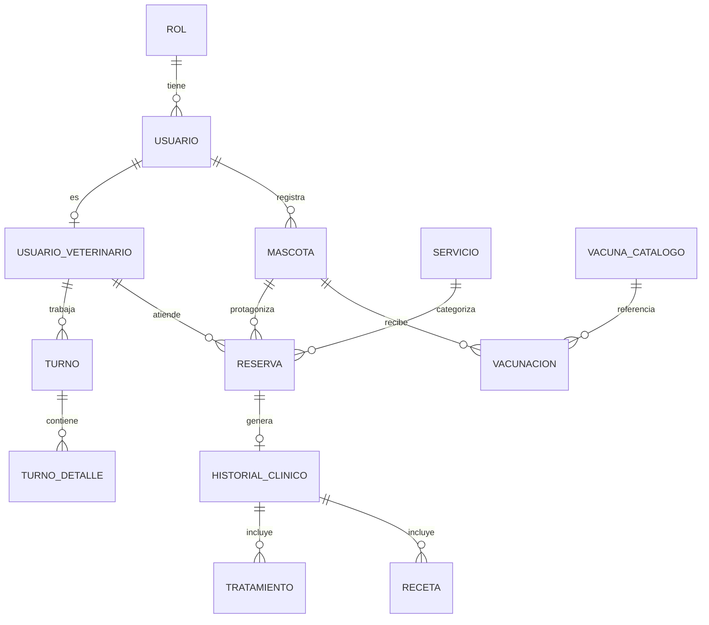

# 🐾 PetVission — Frontend

Aplicación web del sistema PetVission, construida con React + Vite siguiendo una arquitectura por dominio (Screaming Architecture). Desplegada en Vercel.

---

## 👨‍💻 Equipo — Escuadrón Alpha Mango (ETM)

| Nombre | Rol | GitHub |
|---|---|---|
| Sabrina Jeria | Project Manager | [@sabrinaceciliajeria-cmyk](https://github.com/sabrinaceciliajeria-cmyk) |
| Diego Peña | Líder técnico | [@DiegoPenaG](https://github.com/DiegoPenaG) |
| Manuel Labrador | QA / Tester | [@MannuDLab](https://github.com/MannuDLab) |
| Arantxa Fischer | Frontend | [@a-scarfisch](https://github.com/a-scarfisch) |
| Cristian Diaz | Backend | [@Cristian-DH](https://github.com/Cristian-DH) |
| Cristopher Contreras | Backend | [@cristophercontrerasinformatica-dev](https://github.com/cristophercontrerasinformatica-dev) |
| Natalia Medel | Backend | [@NataliaMedelM](https://github.com/NataliaMedelM) |

---

## 🛠️ Stack

| Tecnología | Detalle |
|---|---|
| React 18 | Librería de UI |
| Vite | Build y dev server |
| React Router | Ruteo + rutas protegidas |
| React Context | Estado global por dominio |
| @react-oauth/google | Login con Google |
| CSS | Estilos en `src/styles/` (sin framework CSS) |
| pnpm | Gestor de paquetes |
| Vercel | Hosting / deploy |

---

## 📁 Estructura del proyecto

```
src/
├── main.jsx
├── App.jsx                          ← Router + rutas protegidas
├── index.css
├── assets/
│   ├── hero.png
│   └── vite.svg
├── styles/
│   ├── global.css
│   └── modules/
│       ├── admin.css
│       ├── agendamiento.css
│       ├── auth.css
│       ├── client-layout.css
│       ├── mascotas.css
│       └── vet.css
└── modules/
    ├── core/                        ← Compartido por todos los módulos
    │   ├── components/
    │   │   └── PrivateRoute.jsx
    │   └── lib/
    │       ├── apiClient.js          ← Cliente HTTP (baseURL + interceptores)
    │       └── errorHandler.js       ← Manejo centralizado de errores
    │
    ├── auth/                         ← Login, registro y sesión
    │   ├── components/
    │   │   ├── LoginForm.jsx
    │   │   └── RegisterForm.jsx
    │   ├── hooks/
    │   │   └── useAuth.js
    │   ├── services/
    │   │   └── authService.js
    │   └── states/
    │       └── AuthContext.jsx
    │
    ├── landing/                      ← Página pública
    │   └── components/
    │       └── LandingPage.jsx
    │
    ├── mascotas/                     ← Mascotas del cliente
    │   ├── components/
    │   │   ├── MascotaList.jsx
    │   │   └── NuevaMascota.jsx
    │   └── services/
    │       └── mascotasService.jsx
    │
    ├── client/                       ← Dashboard, reservas y agendamiento
    │   ├── components/
    │   │   ├── ClientLayout.jsx
    │   │   ├── ClientDashboard.jsx
    │   │   ├── MiPerfil.jsx
    │   │   ├── MiConfiguracion.jsx
    │   │   ├── MisCitas.jsx
    │   │   ├── MisReservas.jsx
    │   │   ├── Agendamiento.jsx
    │   │   └── agendamiento/         ← Wizard de 6 pasos
    │   │       ├── AgendaStepper.jsx
    │   │       ├── PasoCategoria.jsx
    │   │       ├── PasoServicio.jsx
    │   │       ├── PasoProfesional.jsx
    │   │       ├── PasoDiaHora.jsx
    │   │       ├── PasoPaciente.jsx
    │   │       └── PasoConfirmar.jsx
    │   ├── pages/
    │   │   └── Agendamiento.jsx
    │   ├── services/
    │   │   ├── agendamientoService.js
    │   │   └── citasService.js
    │   └── states/
    │       └── ClientContext.jsx
    │
    ├── vet/                          ← Dashboard vet, agenda, pacientes e historial
    │   ├── components/
    │   │   ├── VetLayout.jsx
    │   │   ├── VetDashboard.jsx
    │   │   ├── VetCitas.jsx
    │   │   ├── VetHorarios.jsx
    │   │   ├── MisPacientes.jsx
    │   │   └── HistorialClinico.jsx
    │   ├── services/
    │   │   ├── historialService.js
    │   │   └── vetService.js
    │   └── states/
    │       └── VetContext.jsx
    │
    └── admin/                        ← Panel de administración
        ├── components/
        │   ├── AdminLayout.jsx
        │   ├── AdminDashboard.jsx
        │   ├── AdminCitas.jsx
        │   ├── AdminUsuarios.jsx
        │   ├── AdminVeterinarios.jsx
        │   ├── AdminMascotas.jsx
        │   ├── AdminHorarios.jsx
        │   └── TablaResponsiva.jsx    ← Tabla → tarjetas expandibles en móvil
        └── states/
            └── AdminContext.jsx

public/        favicon.svg · icons.svg
(raíz)         index.html · vite.config.js · vercel.json · eslint.config.js · package.json · pnpm-lock.yaml · .env.example
```

> **¿Por qué Screaming Architecture?**
> Abrir `modules/mascotas/` te dice de inmediato qué hace ese código. La estructura grita el dominio del negocio, no el tipo de archivo.

---

## ⚙️ Instalación y ejecución local

### Requisitos previos
- Node.js >= 18
- pnpm >= 9
- Backend corriendo (local en `http://localhost:8080` o el desplegado)

### Pasos

```bash
# 1. Clonar el repositorio
git clone https://github.com/DiegoPenaG/petvission-front.git
cd petvission-front

# 2. Instalar dependencias
pnpm install

# 3. Configurar variables de entorno
cp .env.example .env
# Editar .env con la URL del backend

# 4. Iniciar servidor de desarrollo
pnpm dev
```

La app estará disponible en `http://localhost:5173`

---

## 🌐 Variables de entorno

Crear un archivo `.env` en la raíz del proyecto:

```env
VITE_API_URL=https://proyecto-integrador-pet-vission-backend.onrender.com/api
VITE_GOOGLE_CLIENT_ID=tu_google_client_id
```

> ⚠️ El archivo `.env` **nunca** se sube al repositorio (está en `.gitignore`).
> En Vercel estas variables se configuran en *Project Settings → Environment Variables*.

---

## 🗺️ Modelo de dominio

El frontend consume el modelo de dominio expuesto por el backend vía API REST. La fuente de verdad del esquema vive en el repositorio backend.



---

## 👥 Roles del sistema

| Rol | Acceso |
|---|---|
| **Cliente** | Dashboard, mis mascotas, mis reservas, agendamiento |
| **Veterinario** | Dashboard, agenda/citas, horarios, mis pacientes, historial clínico |
| **Administrador** | Panel: dashboard, usuarios, veterinarios, mascotas, citas y horarios |

Las rutas de cada rol están protegidas por `<PrivateRoute>`, que valida el token JWT antes de renderizar.

---

## 🔗 Backend

API REST. Repositorio: [Proyecto-Integrador-Pet-Vission-BackEnd](https://github.com/DiegoPenaG/Proyecto-Integrador-Pet-vission-BackEnd)

El contrato de respuesta del backend es `ApiResponse<T>` → `{ success, message, data }`; el front extrae los datos desde `response.data.data`.

---

## 📌 Convenciones del equipo

### Ramas
```
main          ← producción estable
dev           ← integración
feature/nombre-de-la-feature
fix/descripcion-del-fix
```

### Commits (Conventional Commits)
```
feat: agrega formulario de registro
fix: corrige validación de contraseña fuerte
refactor: mueve lógica de auth a useAuth hook
style: ajusta estilos del dashboard cliente
```

### Estructura de un módulo
```
modules/mi-modulo/
├── components/   ← JSX visual
├── hooks/        ← lógica y estado local (si aplica)
├── services/     ← llamadas al backend
└── states/       ← estado global del módulo vía React Context (si aplica)
```

### Estilos
Todos los estilos viven en `src/styles/` (`global.css` + `modules/*.css`). No se usan estilos inline.

---

## 📦 Scripts disponibles

```bash
pnpm dev       # Servidor de desarrollo
pnpm build     # Build de producción
pnpm preview   # Preview del build
pnpm lint      # Linter ESLint
```

---

## ✅ Estado de la migración (vanilla → React)

- [x] **Fase 0** — Setup Vite + estructura de carpetas
- [x] **Fase 1** — Módulo `auth` (login + registro + Google OAuth + rutas protegidas)
- [x] **Fase 2** — Módulo `mascotas` (CRUD + soft delete + animal guía)
- [x] **Fase 3** — Módulo `client` (dashboard + reservas + agendamiento de 6 pasos)
- [x] **Fase 4** — Módulos `vet` y `admin`
- [x] **Fase 5** — Módulo `landing`

---

*Proyecto Integrador · Java Generation Chile · Cohorte 24*
